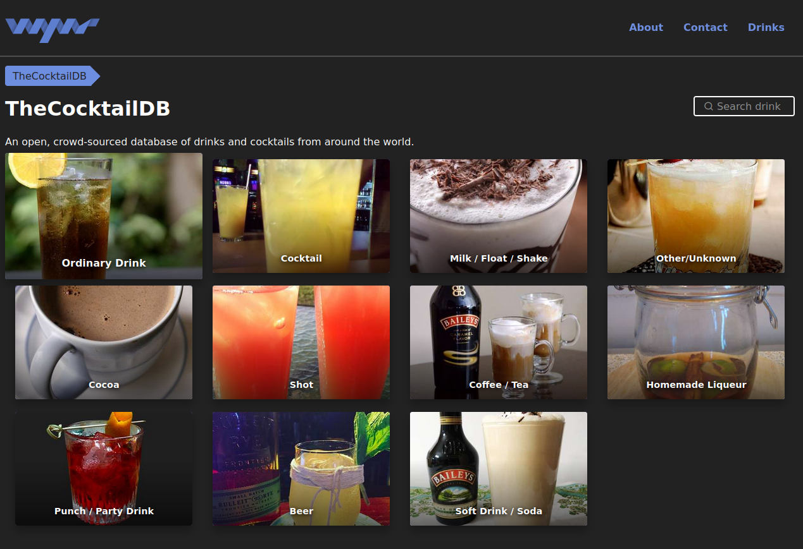
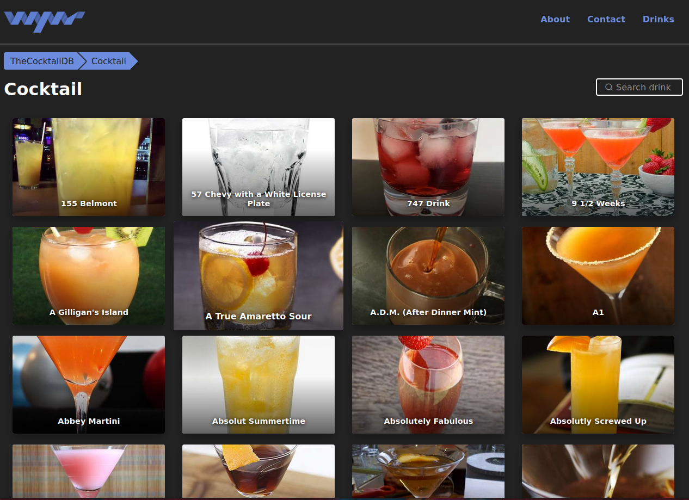
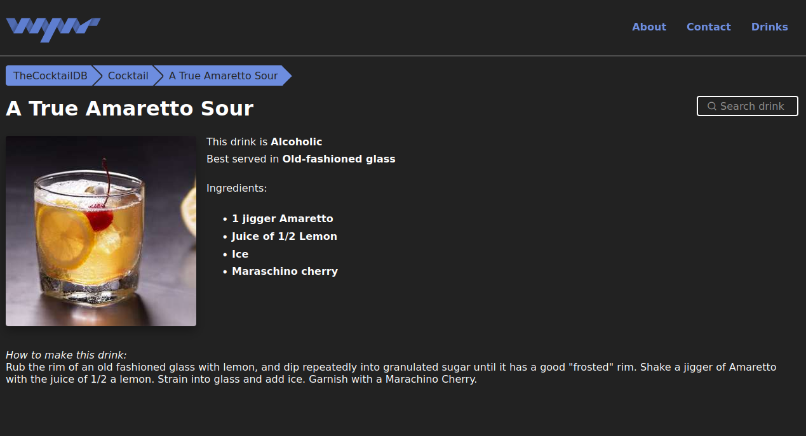
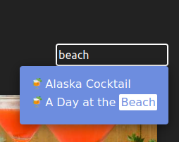

# TheCocktailDB Package

This [wyvr](https://wyvr.dev) package is an sample package to show how to integrate data from external sources, like REST API, with wyvr.

## About [TheCocktailDB](https://thecocktaildb.com)

[TheCocktailDB](https://thecocktaildb.com) was built in 2015 to provide a free data source api for drinks online
in the hope that developers would build applications and cool projects ontop of it.

## What to expact/learn/copy paste

It will create the following functionality

- Load and cache all drinks and there categories from [TheCocktailDB API](https://www.thecocktaildb.com/api.php)
- Create category overview page under `/drinks` 
- Create overview of all drinks in a category under `/drinks/category/{category_slug}` 
- Detail page of every drink under `/drinks/{drink_slug}` 
- Add the following nav structure
    - Drinks
        - [category 1]
        - [category 2]
        - ...
- 3 different page components
- Boilerplate code to consume API
- Using helpers from wyvr to reduce code complexity

## Install

Install the package

```bash
npm i @wyvr/pkg-the-cocktail-db
# or
yarn add @wyvr/pkg-the-cocktail-db
# or
pnpm i @wyvr/pkg-the-cocktail-db
```

Add the following code to your `wyvr.js`

```js
module.exports = {
    //...
    packages: [
        //...
        {
            name: 'TheCocktailDB',
            path: '@wyvr/pkg-the-cocktail-db',
        },
        //...
    ],
    //...
};
```

After installing and adding the package restart the wyvr service.
> WARNING: loading of all drinks can take 3-4 minutes, because there is no api endpoint to receive all drinks and there details informations at once

## Dependencies

`@src/component/Image.svelte`  
This component is used in the page components to display the images

Possible solutions:
- the component can be found in the package [pkg-web](https://packages.wyvr.dev/view/pkg-web)  
- or use a component with the same name/path and properties  
- or override the page components with your own logic


## Screenshots




